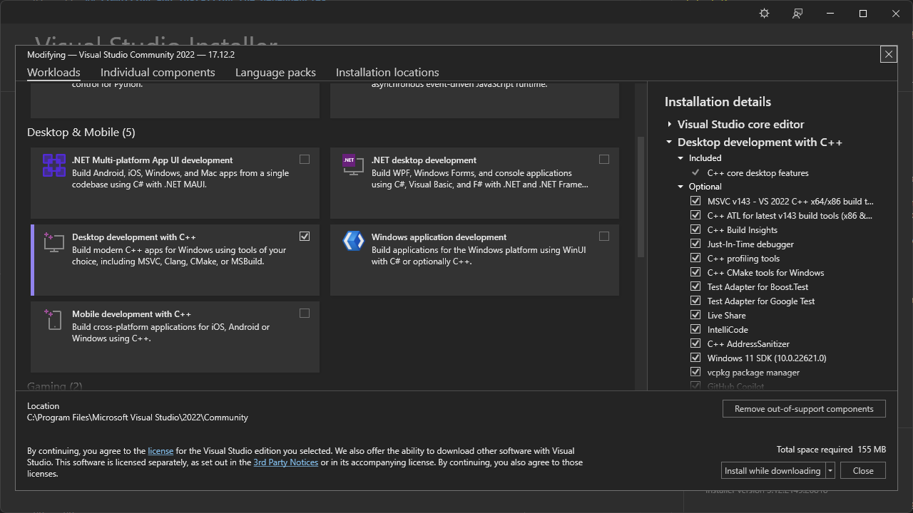
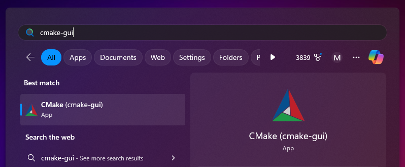
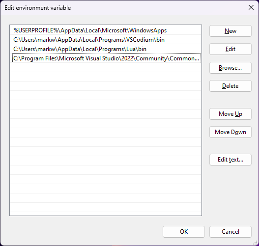
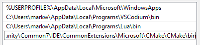

# Compiling on Windows using MSVC

If you're just creating mods or games with Luanti, you do not need to compile Luanti. Instead, follow Ruben Wardy's [Luanti Modding Book](https://rubenwardy.gitlab.io/minetest_modding_book) to get started modding. Compiling Luanti is only required if you plan to modify the Luanti engine itself.

In this guide, we use `path/to/luanti` to refer to the repository.

## 1. Machine requirements

Luanti is compiled via Visual Studio and CMake, and version control is managed with Git.

-   [Visual Studio 2015 or newer](https://visualstudio.microsoft.com) including "Desktop development with C++" (includes CMake CLI but not CMake GUI)
-   [Git](https://git-scm.com/downloads)

### 1.1. Visual Studio (VS) with C++

1. Install VS from [visualstudio.microsoft.com](https://visualstudio.microsoft.com)
1. In the VS installer, select "Desktop development with C++":

    

1. Confirm the installation.

This will install the C++ compiler used in later steps. VS is also the recommended IDE for Luanti.

### 1.2. CMake

The CMake GUI is a great tool to manage first-time setup of Luanti. It's not required, but recommended for anyone unfamiliar with CMake or its CLI. CMake itself comes bundled with Visual Studio, but the CMake GUI does not, and must be installed separately.

Install from [cmake.org/download](https://cmake.org/download/). Once installed, you should be able to run `cmake-gui` from the start menu:



Installing CMake this way also adds it to your PATH environment variable, and you should be able to run `(Get-Command cmake).Path` in PowerShell or `which cmake` in Bash and get a result.

If you don't install CMake manually, and are relying on the version that comes bundled with Visual Studio, you can follow these steps:

1. Find the `/path/to/bin/CMake.exe`. It should be at or around `C:\Program Files\Microsoft Visual Studio\2022\Community\Common7\IDE\CommonExtensions\Microsoft\CMake\CMake\bin\cmake.exe`.
1. Edit your PATH environment variable to include the `/path/to/bin` (but not `cmake.exe`).

    1. Start menu > Search "env" > Edit the system environment variables > Environment Variables... > Path > Edit... > New > Paste the path from step 1

    

    

1. Restart your terminal
1. Try `(Get-Command cmake).Path` in PowerShell or `which cmake` in Bash to ensure CMake can be executed from the terminal.

## 2. Install Luanti dependencies

Once VS and CMake are ready to use, you can install Luanti's dependencies. Luanti requires several C++ packages to function, which are installed by CMake and compiled by a C++ compiler bundled with VS. CMake uses a tool called vcpkg behind the scenes, which you may see referenced elsewhere in this project.

### 2.1. Optional dependencies

Some optional dependencies are recommended for advanced development. You can add them to `vcpkg.json` to install them along with the required dependencies.

-   `curl` is highly recommended, as it's required to read the serverlist; `curl[winssl]` is required to use the content store.
-   `openal-soft`, `libvorbis` and `libogg` are optional, but required to use sound.
-   `luajit` is optional, it replaces the integrated Lua interpreter with a faster just-in-time interpreter.
-   `gmp` and `jsoncpp` are optional, otherwise the bundled versions will be compiled
-   `gettext` is optional, but required to use translations.

### 2.2. Install dependencies

You can install dependencies via CLI or via CMake GUI, whichever your prefer.

To install dependencies via CLI, you can run this program in PowerShell:

```powershell
# Run this while in `path/to/minetest`
$vs="Visual Studio 17 2022" # or "Visual Studio 16 2019", whatever matches your machine
$toolchain_file="C:/Program Files/Microsoft Visual Studio/2022/Community/VC/vcpkg/scripts/buildsystems/vcpkg.cmake" # or wherever you installed vcpkg.cmake manually
cmake build -G "$vs" -DCMAKE_TOOLCHAIN_FILE="$toolchain_file" -DCMAKE_BUILD_TYPE=Release -DENABLE_CURSES=OFF
```

The above steps may take about 10-30 minutes, depending on your device.

You may see several warnings and even errors. For now, you may be able to ignore those and try going to step 3 once the installation completes. If you are struggling, please open an issue on the GitHub repo.

To install dependencies via CMake GUI:

1. Start up the CMake GUI (Win > search "cmake-gui" > open)
1. Select **Browse Source...** and select `path/to/luanti` (where you've cloned the repo)
1. Select **Browse Build...** and select `path/to/luanti/build` (a new folder that CMake will prompt to create)
1. Select **Configure**
1. Choose the right Visual Studio version and target platform. Currently, Luanti uses Visual Studio 16 2019, but newer VS versions should work as well. The VS version has to match the version of the installed dependencies.
1. Choose **Specify toolchain file for cross-compiling**
1. Click **Next**
1. Select the vcpkg toolchain file, e.g. `C:/Program Files/Microsoft Visual Studio/2022/Community/VC/vcpkg/scripts/buildsystems/vcpkg.cmake`.
1. Click Finish
1. Wait until CMake generates the cache file (this may take about 10-30 minutes, depending on your device)
1. If there are any errors, solve them and hit **Configure**
1. Click **Generate**
1. Click **Open Project**

You may see several warnings and even errors. For now, you may be able to ignore those and try going to step 3 once the installation completes. If you are struggling, please open an issue on the GitHub repo.

## 3. Compile Luanti

Once the dependencies are installed, there are two ways to compile Luanti: via Visual Studio or via CLI.

### 3.1. Compile in Visual Studio

14. Compile Luanti inside Visual Studio using the green play button.
    -   If you get "Unable to start program '...\x64\Debug\ALL_BUILD'. Access is denied", try compiling via the CLI instead.

### 3.2. Compile via CLI

Run the following command:

```powershell
# Run this while in `path/to/minetest`
cmake --build build --config Release
```

## 4. Running Luanti

Once Luanti is compiled, you should be able to run `path/to/minetest/bin/Release/luanti.exe` and start up the Development Test game :)

## 5. Making changes

If you make changes to the C++ code, you can usually just re-compile without re-installing the dependencies. Then you can re-run Luanti to confirm that your changes were applied.

## Appendix: Windows Installer using WiX Toolset

Requirements:

-   [Visual Studio 2017](https://visualstudio.microsoft.com/)
-   [WiX Toolset](https://wixtoolset.org/)

In the Visual Studio 2017 Installer select **Optional Features -> WiX Toolset**.

Build the binaries as described above, but make sure you unselect `RUN_IN_PLACE`.

Open the generated project file with Visual Studio. Right-click **Package** and choose **Generate**.
It may take some minutes to generate the installer.
