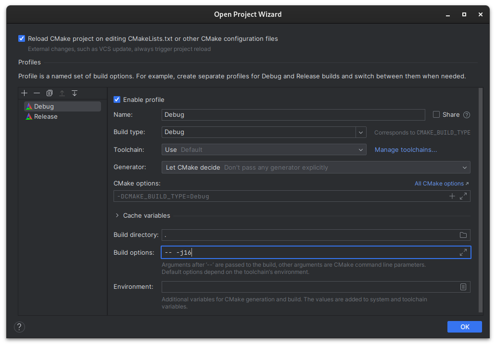

# [Jetbrains IntellIJ CLion](https://www.jetbrains.com/clion)

## Linux

When opening the folder for the first time, select "Open as CMake project"

The IDE will open the folder and display the open project wizard:

In this wizard, you can create profiles that will be used to build the project.

By default only a profile with the `Debug` build type is created. You can create a new profile by clicking on the "+"
button if you want to create builds with the `Release` build type for exemple.

Make sure to switch the Generator to `Let CMake decide` or `Unix Makefiles`.

You can change the build options passed to Make, for exemple if you want to change the number of threads used to build
the project (`-j`).

The CMake profiles can be later configured in `Settings > Build, Execution, Deployment > CMake`.

The configuration of the CMake project created the CMake run configurations that can be accessed from the toolbar to
build, run and debug the program. At the left there is the dropdown to change the CMake profile.

From the recent project view when you start CLion, you can rightclick the project and change it's icon to make it easier
to navigate your projects.

## Windows

Under Windows, you the recommended compiler is the [Visual Studio](https://visualstudio.microsoft.com) compiler.

From the Visual Studio installer, you need to install the `Desktop development with C++` Workload. CMake is already
bundled in CLion.

By default, CLion have a MinGW compiler bundled, so if you want to use Visual Studio, you need to configure it as the default compiler.

CLion may ask you in the open project wisard for your compilers, with MinGW and Visual Studio if you have installed it predefined. You can use the arrows to make `Visual Studio` the default.

If not you can go to `Settings > Build, Execution, Deployment > Toolchains` to change it.

Then, the process is roughly similar to Linux, you just need to pick `Visual Studio` as toolchain.

[Vcpkg](https://vcpkg.io) is the recommended way of installing Minetest dependencies.

You need to let CLion know about a `vcpkg` installation to let the bundled CMake use the dependencies seamlessly and get
IDE integration. (Require CLion 2023 or later)

Go to `View > Tool Windows > Vcpkg` and click the add button. I will open a popup allowing you to add a Vcpkg
installation. By default it will download a new one that you can use to install your dependencies, but if you already
have one installed or you do not plan on using CLion only then install Vcpkg by hand and select your installation
directory. Don't forget to check `Add vcpkg installation to existing CMake profiles`. If you haven't already installed
Minetest dependencies in your vcpkg installation, you can do it right from CLion's Vcpkg tool window.

Reloading the CMake project (should happen automatically, or display a notification for outdated CMake project) will now
load the dependencies.

[More infos on Vcpkg integration in CLion](https://blog.jetbrains.com/clion/2023/01/support-for-vcpkg-in-clion)

