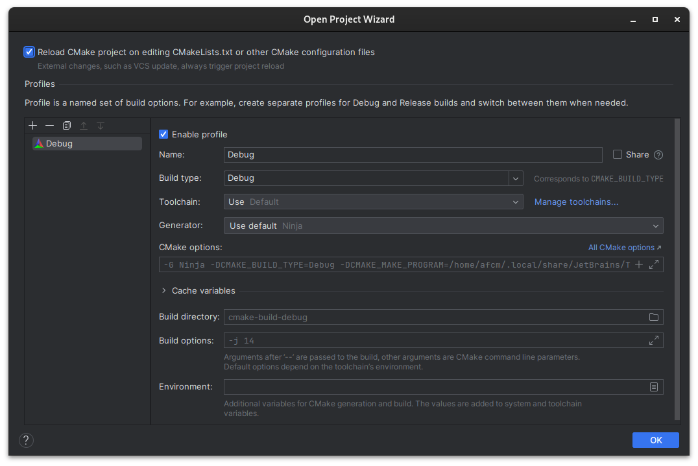
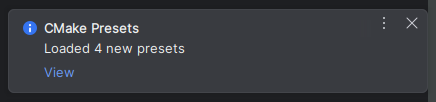
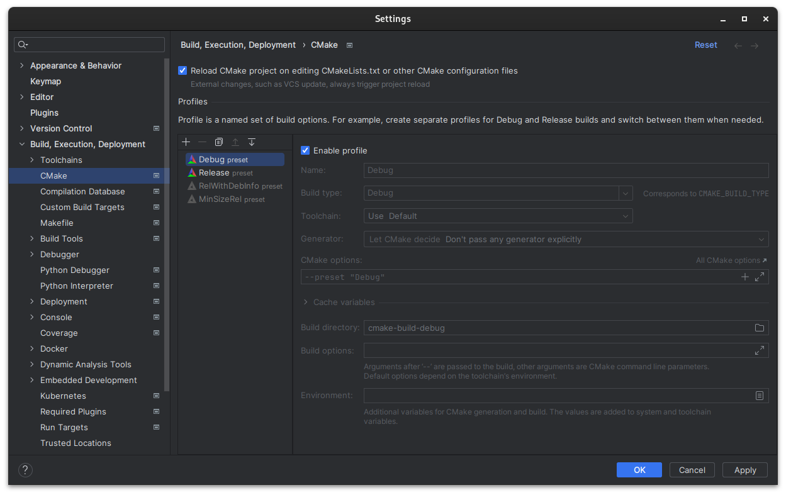
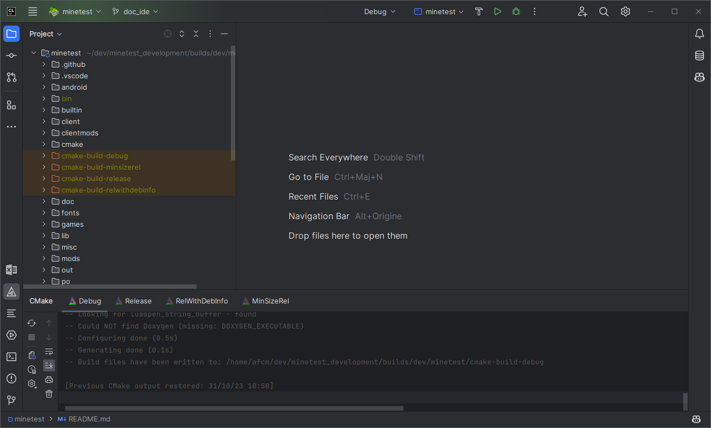
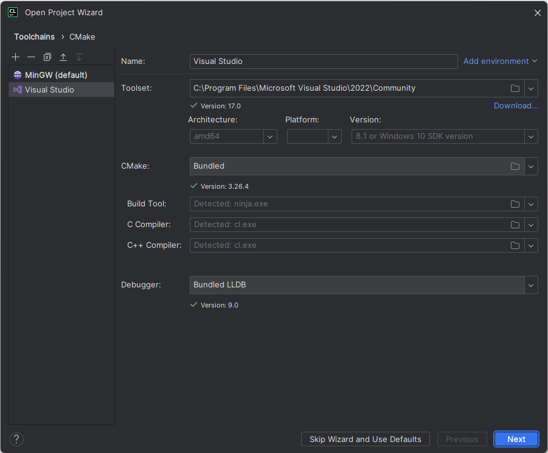
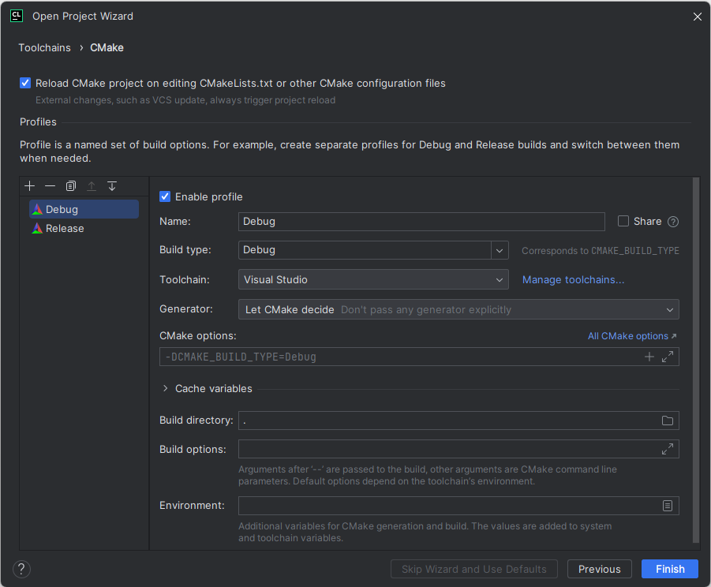
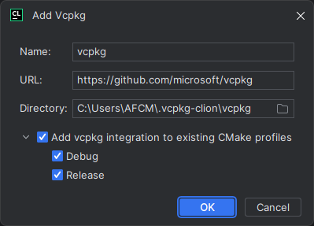

# [Jetbrains IntellIJ CLion](https://www.jetbrains.com/clion)

## Linux

When opening the folder for the first time, select `Open as CMake project` if the IDE ask you between Make and CMake.

The IDE will open the folder and display the open project wizard:

CLion try to determine a base configuration, but Minetest define it's own presets for easier setup. So you need to
delete the `Debug` profile with the `-` sign and close the dialog.

You should notice a notification telling you 4 presets have been loaded in the bottom right corner.

Clicking on the `View` link or going to `Settings > Build, Execution, Deployment > CMake` you should get a window
similar to the Open Project Wizard, but with the readonly presets listed.

By default, none of the presets are enabled. You can select them and enable the ones you want. Keep in mind that
triggering the CMake project reload (VCS updates, config changes, etc) will reload all the enabled profiles, so unless
you need the other ones you can enable just `Debug` and `Release`.

If none of the availlable profiles fit your needs, you can create a `CMakeUserPresets.json` file, edit it by hand and
CLion will load the presets in this window. But the easiest solution is to create an editable copy of one of the availlable
presets with the `Copy` button icon.

After these steps you should get an IDE like this.

On the main toolbar at the top right, you have a dropdown for selecting the CMake profile to use for the build. You have another dropdown next to it to select the build target; by default the `minetest` executable will be selected, but you may also have to use `IrrlichtMt` for building just the library .

You can rightclick the topbar to change the project icon and color, for fancier looking IDE.

## Windows

Under Windows, the recommended compiler is the [Visual Studio](https://visualstudio.microsoft.com) compiler.

From the Visual Studio installer, you need to install the `Desktop development with C++` Workload. CMake is already
bundled in CLion.

By default, CLion have a MinGW compiler bundled, so if you want to use Visual Studio, you need to configure it as the default compiler.

CLion may ask you in the open project wisard for your compilers, with MinGW and Visual Studio if you have installed it predefined. You can use the arrows to make `Visual Studio` the default.

If not you can go to `Settings > Build, Execution, Deployment > Toolchains` to change it.

Then, the process is roughly similar to Linux, you just need to pick `Visual Studio` as toolchain.

[Vcpkg](https://vcpkg.io) is the recommended way of installing Minetest dependencies.

You need to let CLion know about a `vcpkg` installation to let the bundled CMake use the dependencies seamlessly and get
IDE integration. (Require CLion 2023 or later)

Go to `View > Tool Windows > Vcpkg` and click the add button. I will open a popup allowing you to add a Vcpkg
installation. By default it will download a new one that you can use to install your dependencies, but if you already
have one installed or you do not plan on using CLion only then install Vcpkg by hand and select your installation
directory. Don't forget to check `Add vcpkg installation to existing CMake profiles`. If you haven't already installed
Minetest dependencies in your vcpkg installation, you can do it right from CLion's Vcpkg tool window.

Reloading the CMake project (should happen automatically, or display a notification for outdated CMake project) will now
load the dependencies.

[More infos on Vcpkg integration in CLion](https://blog.jetbrains.com/clion/2023/01/support-for-vcpkg-in-clion)

