## Installation

### Requirements
* C++11 compiler
* CMake
* Boost headers 
* gnuplot

### Instructions

```bash
cmake .. -G Xcode -DBGI_ENABLE_CT=ON -DCMAKE_BUILD_TYPE=Release
make -j 8
./run_benchmark.sh ./build/Release/ <your_results_folder>

# the benchmark script will also run the gnuplot command:
gnuplot ./plot_results.plt
```

## Benchmarks

Benchmark setup is based on [spatial_index_benchmark](https://github.com/mloskot/spatial_index_benchmark) by Mateusz Loskot and Adam Wulkiewicz.

### Results

HW: Intel(R) Core(TM) i7-4870HQ CPU @ 2.50GHz, 16 GB RAM; OS: macOS Sierra 10.12.16

* Loading times for each of the R-tree construction methods

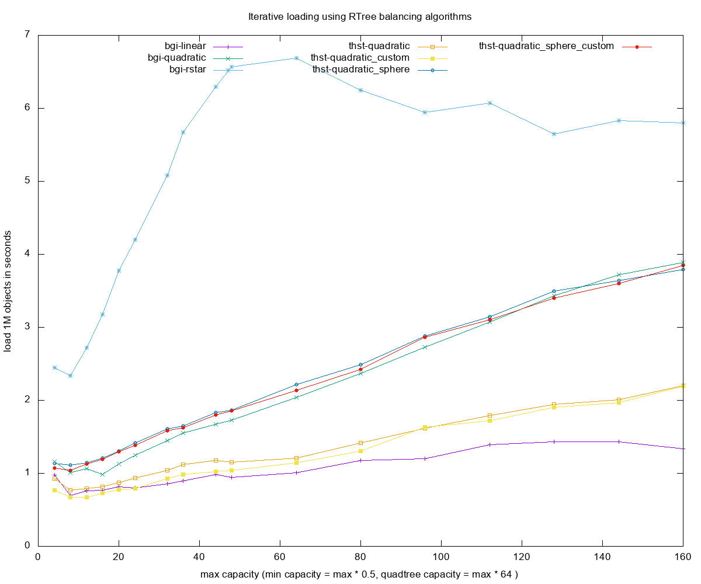

Best loading performance is given by the bulk loading algorithm, followed by linear:
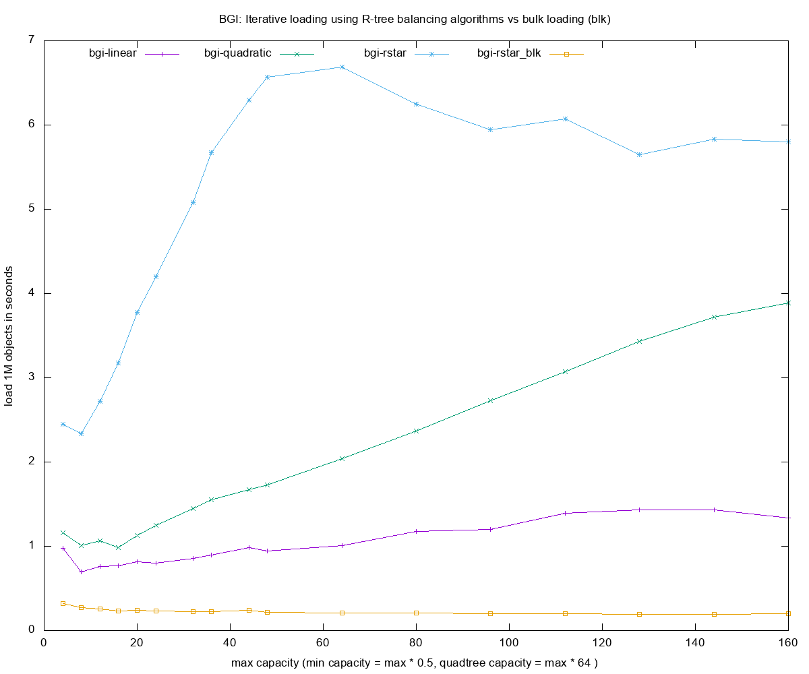

As expected, the heurestic type doesn't affect bulk loading performance:
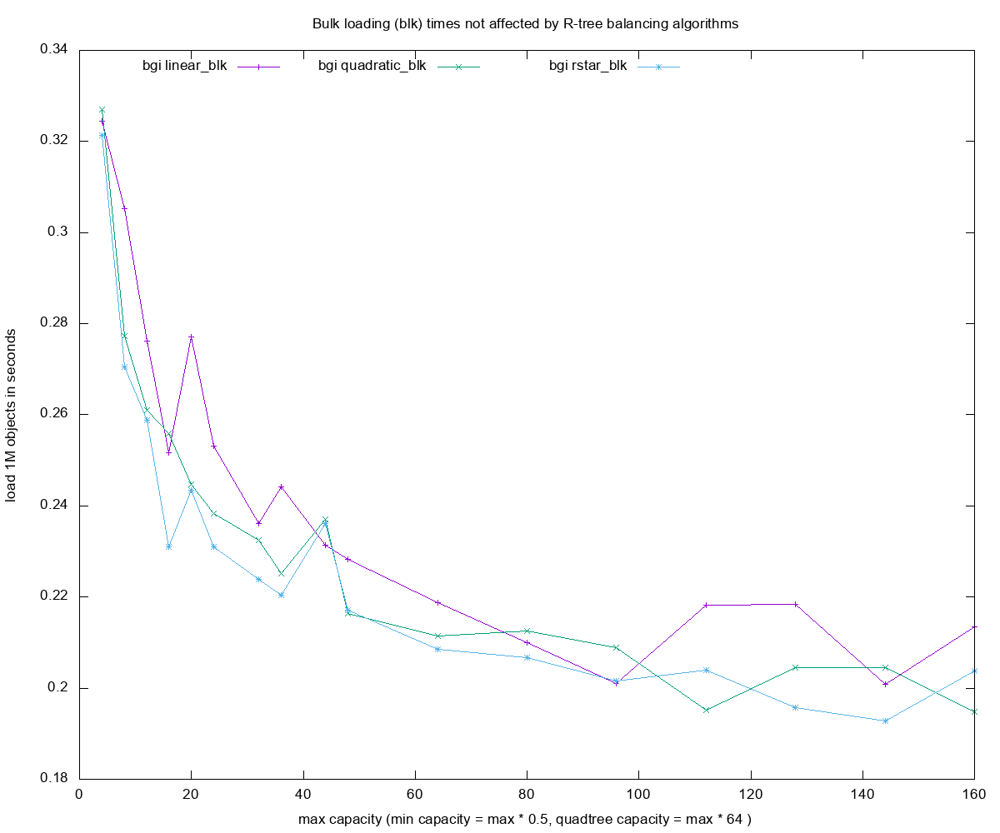

Creating the quadtree is very slow for capacities between 256 and 1024, while the custom quadratic variant produces the best performance:
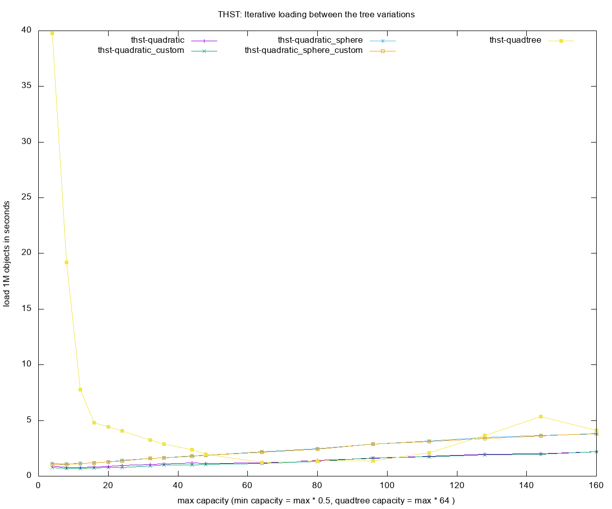

* Query times for each of the R-tree construction methods

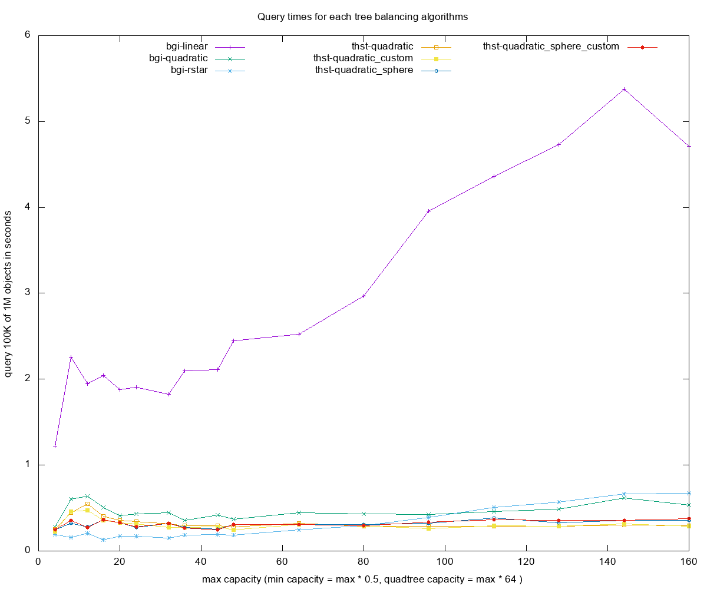

Best query times, rstar and bulk loading produce best times and followed by the thst's quadratic custom:
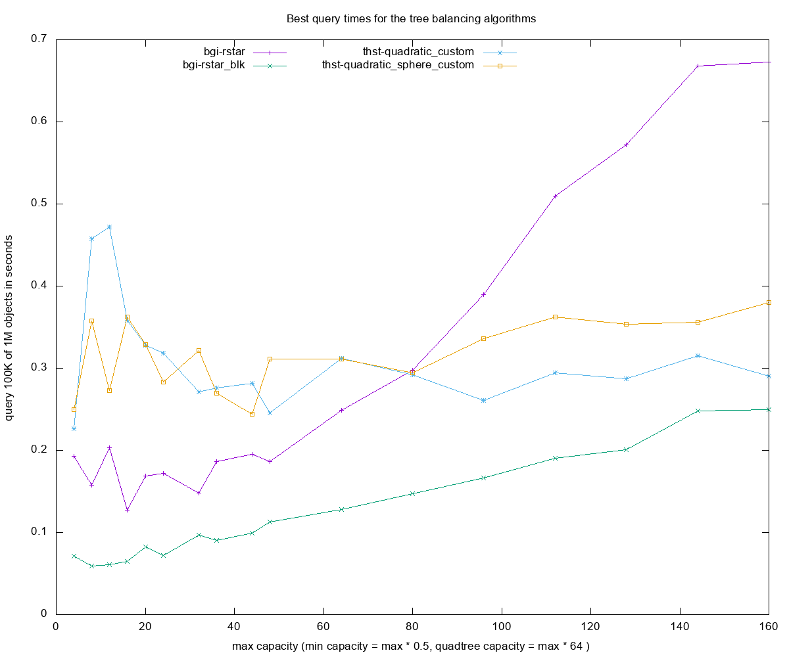

Bulk loading produces the best query times from all heurestics:
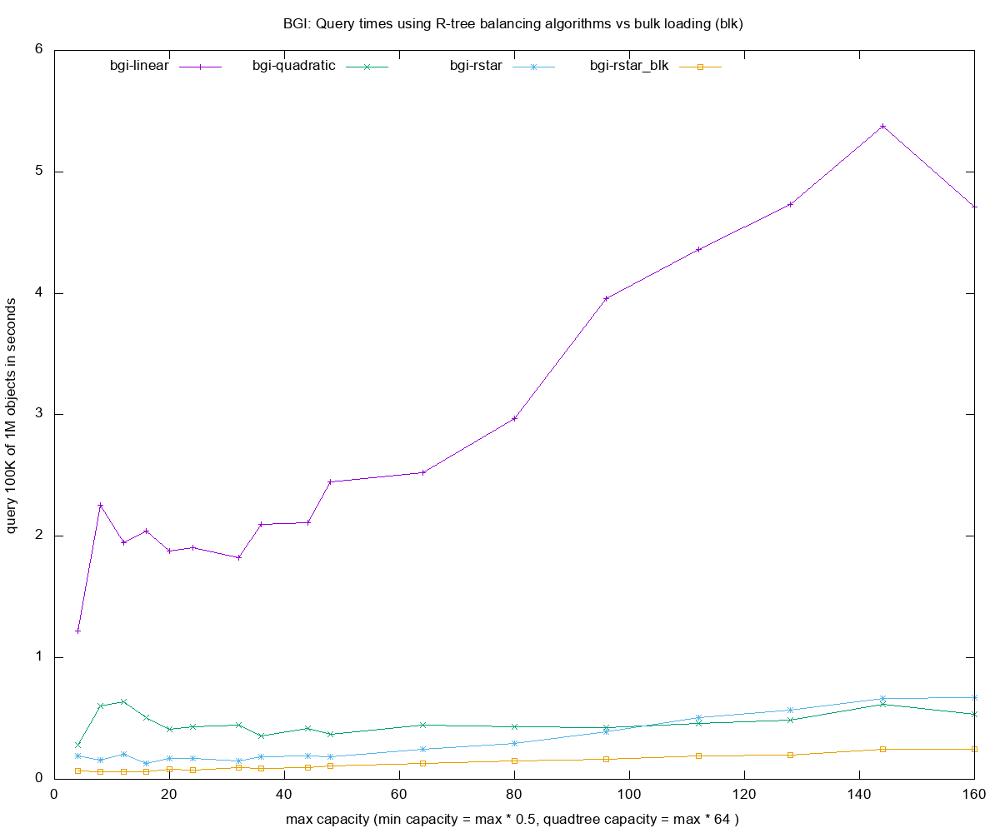

As expected, the heurestic type doesn't affect query performance of the bulk loading algorithm:
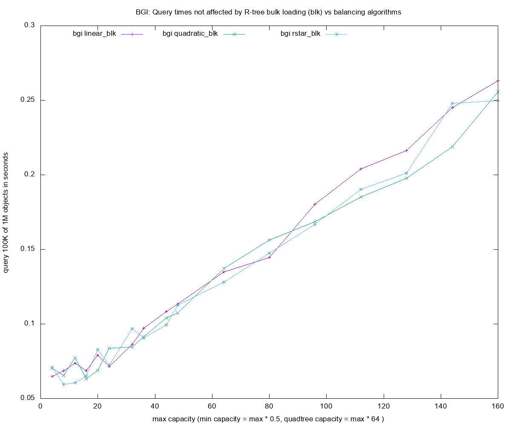

Query times for the quadtree are really slow:


The custom allocator is slightly faster than the normal one:
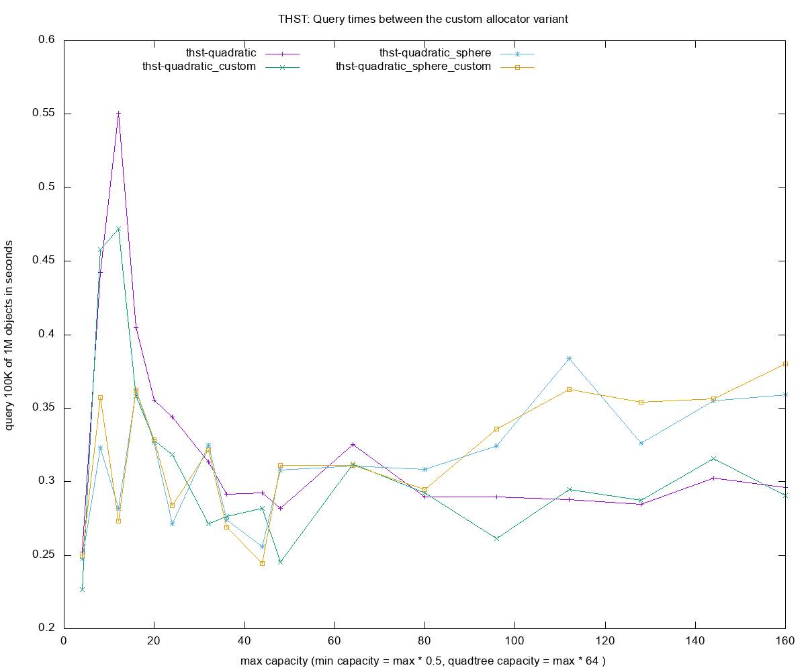

* Dynamic use case, average time for each of the R-tree construction methods

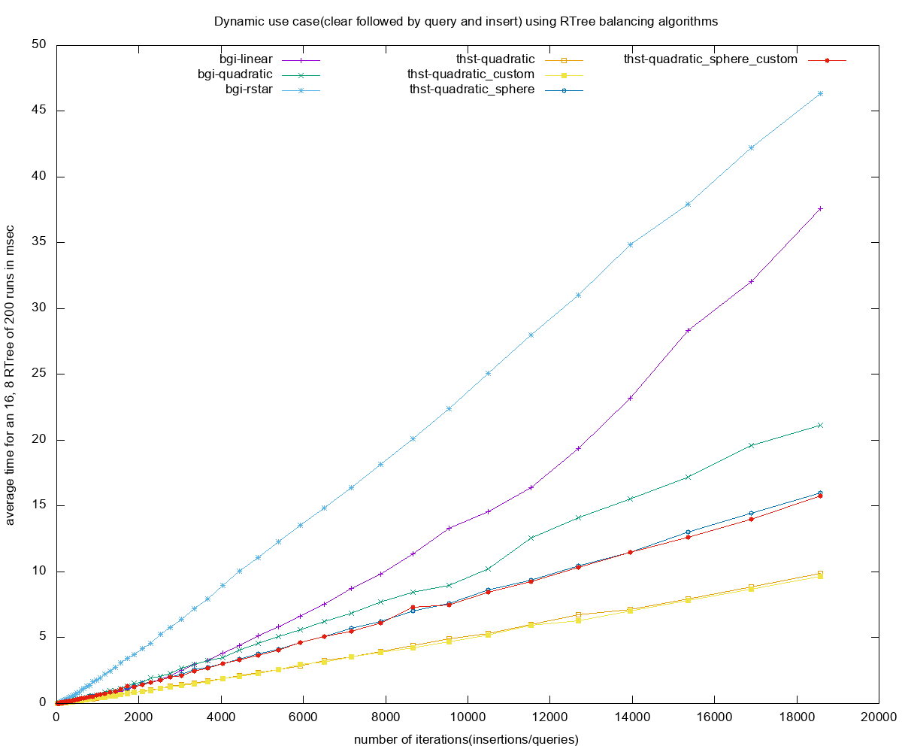

At around 400 objects the thst quadratic method is faster than the bgi linear version:
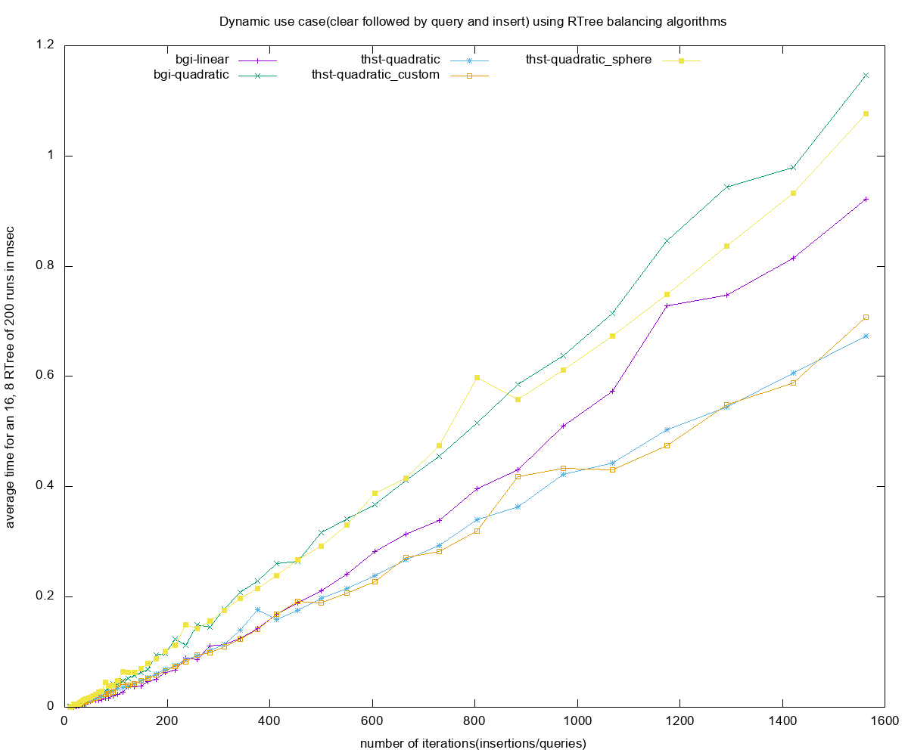

Under 400 objects bgi linear is slightly faster, however this heavily depends on how many objects pass the query test, in the given test case almost all objects pass the intersection test.
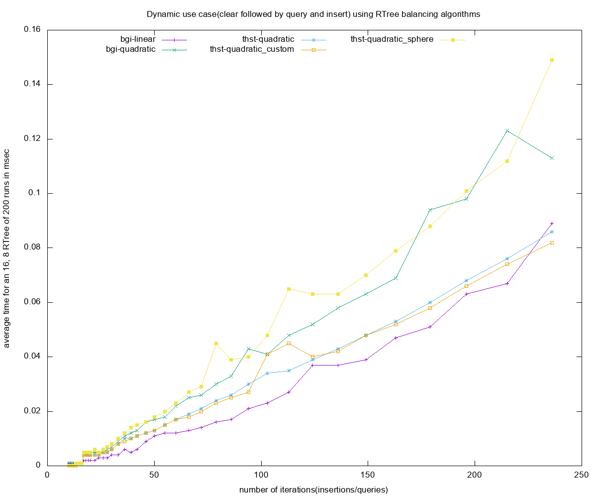

### Legend
------

* ```bgi``` - boost::geometry::index, compile time
* ```thst``` - thst
* ```ct``` - compile-time specification of rtree parameters
* ```rt``` (or non suffix) - Boost.Geometry-only, run-time specification of rtree parameters
* ```L``` - linear
* ```Q``` - quadratic
* ```QT``` - quadtree
* ```R``` - rstar
* ```itr (or no suffix)```  - iterative insertion method of building rtree
* ```blk```  - bulk loading method of building R-tree (custom algorithm for ```bgi```)
* ```custom``` - custom allocator variant for thst(cache friendly, linear memory)
* ```sphere``` - sphere volume for computing the boxes's volume, better splitting but costlier
* insert 1000000 - number of objects small random boxes
* query   100000 - number of instersection-based queries with random boxes 10x larger than those inserted
* dynamic 200 - number of runs composed of clear, instersection-based queries and insert with small random boxes
